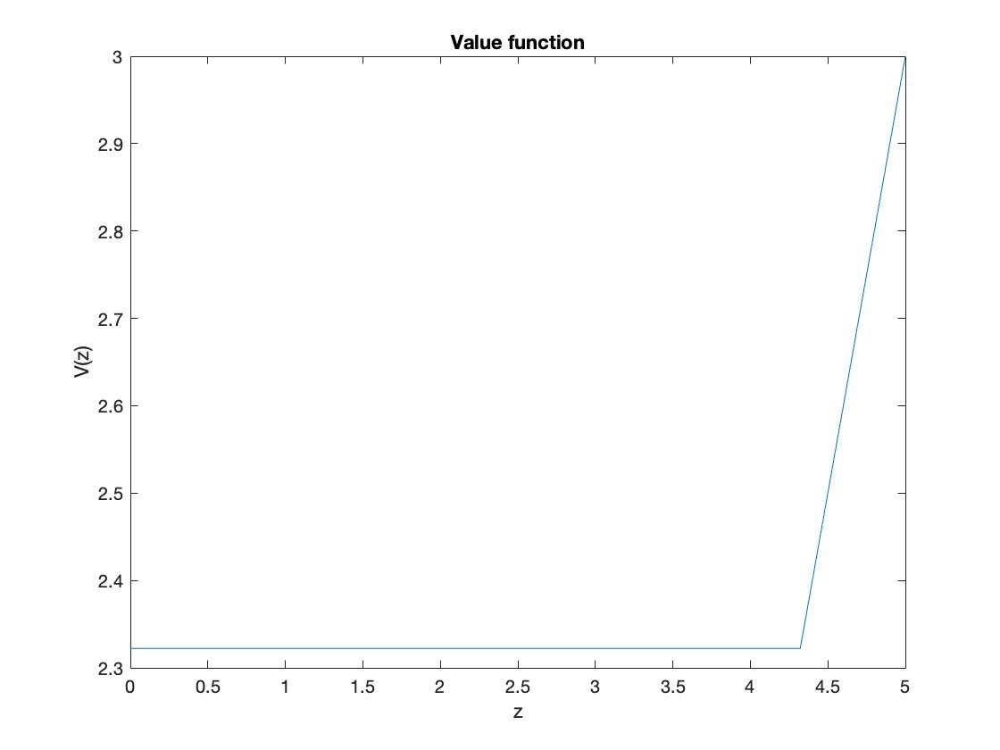
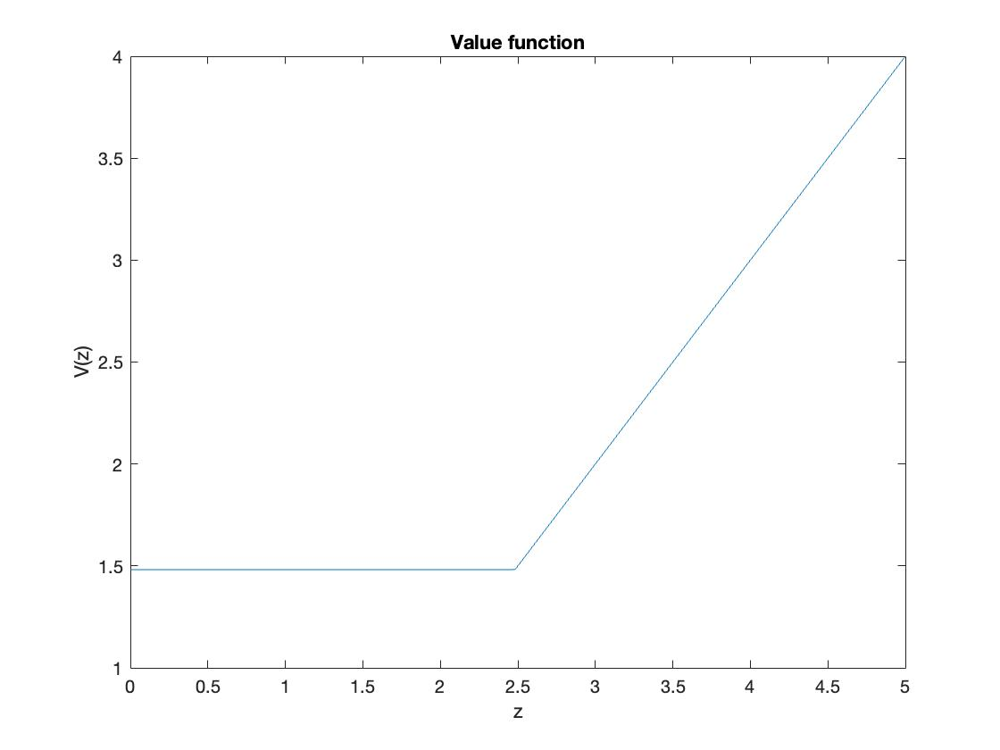
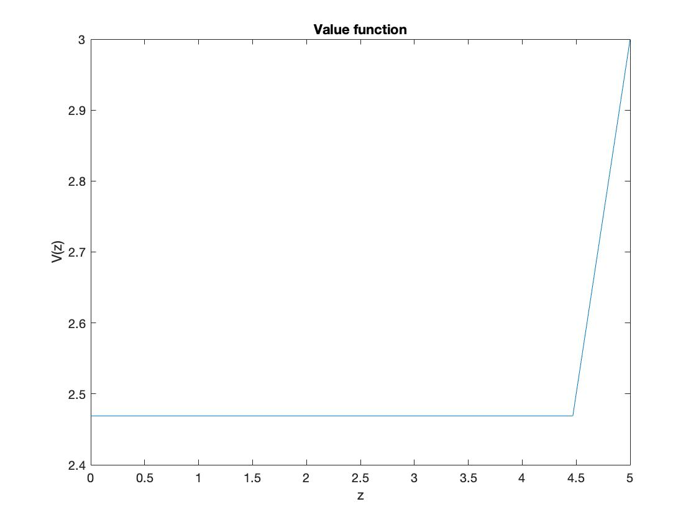
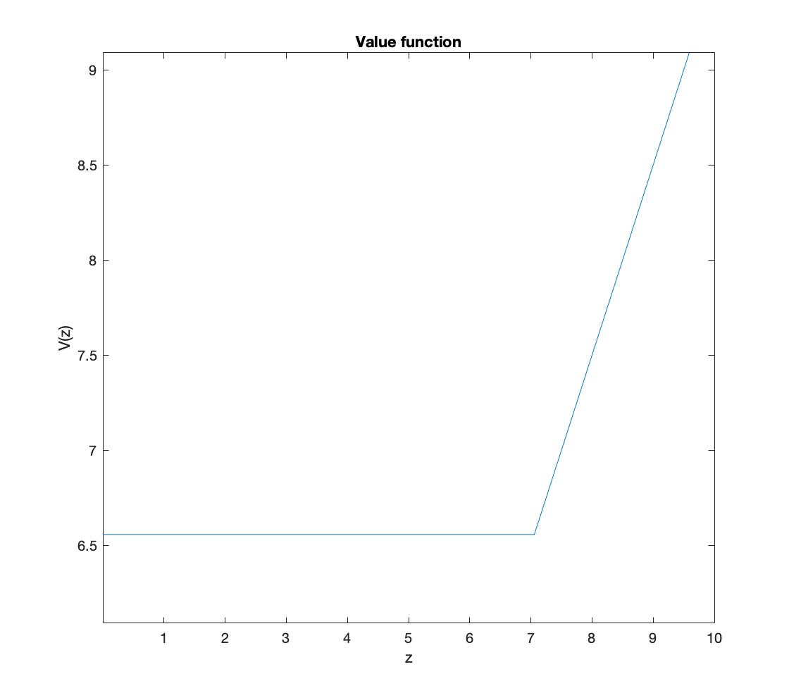
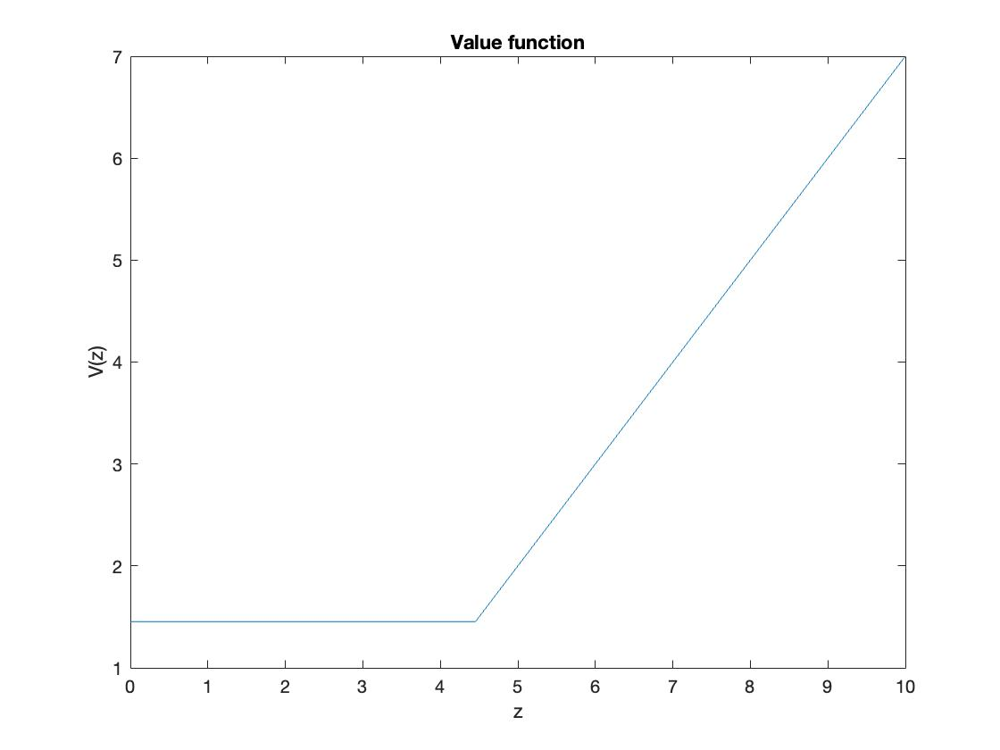
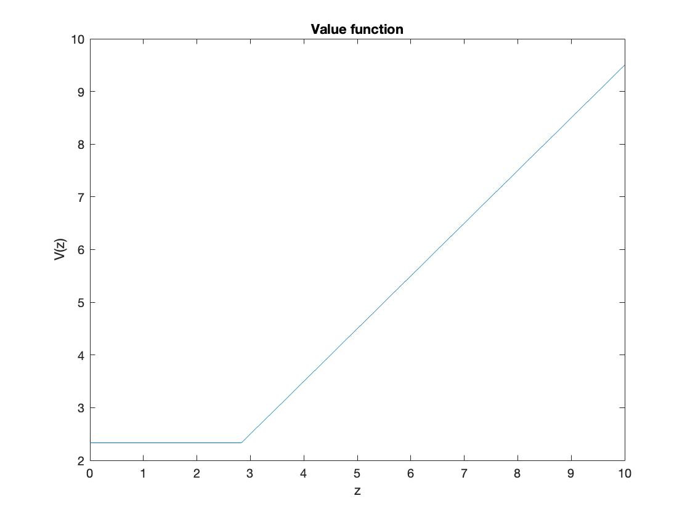

```{r setup, include=FALSE}
knitr::opts_chunk$set(echo = TRUE, warning=FALSE, message=FALSE)
```


Think about the investment model in the lecture. In this report, you will numerically solve this model using the value function iteration method with Matlab. We derived some equations in the lecture, but in this report you can use only two functions below.  
\begin{itemize} 
\item Value function: $V(z)=\max\left\{ \beta \int_0^B V(z')dF(z'), z - I \right\}$
\item Policy function: $\begin{cases} \text{invest} \;\;\; \text{if } z > z^* \\\text{wait} \;\;\:\:\: \text{ if } z \le z^*\end{cases}$
\end{itemize}  

Parameter values and the shape of distribution $F(z)$ are up to you.

# Problem 1  

**Question 1**: Solve this problem using the value function iteration method. You need to discretize $V(z)$ and $F(z)$ on a finite number of grids. Also, use the initial guess of the value function as $V (z) = 0$ for all $z$. Plot $V (z)$ and discuss its shape.
$$\dagger$$
For this first exercise, I used the following parameters: 
$$
\begin{aligned}
\beta &= 0.98 \\
I &= 2 \\
F &\sim Unif\left[0, 5\right]
\end{aligned}
$$
The high discount factor $\beta$ suggests that our investor is patient and is willing to wait to increase their profits. Furthermore, the cost of $I = 2$ for investment means that any value between 2 and 5 will yield a profit, and since the distribution is uniform, the expected value of returns will be considerably higher than the cost. Judging from all the above, we can expect the cutoff value for the policy function $z^*$ will be quite high. Below, I plot the optimized value function $V(z)$.  


  
The graph tells us that the cutoff value $z^* \approx 4.32$ and the corresponding $V(z^*) \approx 2.32$. As we expected, the cutoff value is quite high and shows that the investor is well posed to wait for a favorable outcome. The graph is flat until $z = z^*$, meaning the investor will wait for any value below the cutoff value, and hence their utility will be the expected utility of waiting, which is $V(z^*)$. Above the cutoff value, the investor will take any offer and pay the cost, keeping the difference as a profit.     

# Problem 2  

**Question 2**: Change the parameter values of $I$ and $\beta$. Plot $V (z)$ and discuss how and why the shape is changed. 
$$\dagger$$
Now, we change the parameters as below: 
$$
\begin{aligned}
\beta &= 0.7 \\
I &= 1 \\
\end{aligned}
$$

We will use the same distribution of $z$.  
Now, we have an impatient investor with a discount factor of $0.7$, meaning they are less willing to wait to invest and prefer a moderate immediate profit to a high profit in the distant future. On the other hand, now the investor has a cost of investment of only $I = 1$, suggesting it is much easier for them to make a profit from the investment. This may also induce the investor to take a lower cutoff value, since they would require less to make a considerable profit off of the investment. We plot $V(z)$ with these renewed parameters below:  


As we expected, the cutoff value is now $z^* \approx 2.48$ and $V(z^*) \approx 1.48$. This confirms our prediction that the cutoff value would be considerably lower than in problem 1, and our new investor would be much more eager to sell their investment at an earlier time.  

# Problem 3  

**Question 3**: Suppose that the investor can get two investment opportunities each period. These follow the same distribution as in Question 1. In addition, these two are independent. Each period, the investor can take the better offer, or wait. Solve this problem using the value function iteration method. Plot $V (z)$ and compare the result with Question 1.
$$\dagger$$
Let the returns from the two investment opportunities be random variables $Z_1, Z_2 \stackrel{i.i.d.}{\sim} Unif[0, 5]$. Then, we know that at every investment opportunity, the investor would invest in $\max\{Z_1, Z_2\}$. Consider the following:  
\newline
Assume there are two uniform random variables $X_1, X_2 \stackrel{i.i.d.}{\sim} Unif[a, b]$. Then, we consider the distribution of $Z = \max \{X_1, X_2\}$. 
$$\begin{aligned}
F_Z(z) &= F_{X_1}(z) F_{X_2}(z) \\
&= \left(\frac{z - a}{b - a}\right)^2 \\
f_Z(z) &= \frac{\partial}{\partial z} \left(\frac{z - a}{b - a}\right)^2 \\
&= \frac{2(z-a)}{(b-a)^2}
\end{aligned}$$
\newline
Therefore, we can treat the two independent investment opportunities as one random variable. Then, we plug in the upper and lower bound values to the probability distribution function of two iid uniform variables we have derived above. If we denote $Z = \max\{Z_1, Z_2\}$, and the pdf of $Z$ as $f_Z$, then 
$$f_Z(z) = \frac{2z}{25}$$
Therefore, the problem now is restated as finding the optimal cutoff point for an investment opportunity $Z$ which has a probability distribution function of $f_Z(z) = \frac{2z}{25}$. In order to approximate this probability density function to probability mass function in our discrete representation of $z$, we instead use $f_Z(z_i) \approx F_Z(z_i) - F_Z(z_{i-1})$. Then, using the same parameters as in question 1, we get the following graph:  

Now, the cutoff point $z^*$ has increased from its value of $4.32$ in question 1 to $4.46$ in question 4. Concomitantly, the value function $V(z^*)=2.46$. The reason for this increase is that the new distribution renders larger values of $z$ more probable than lower values of $z$, a direct result of using the maximum function on two identically distributed independent variables.  

# Problem 4  
**Question 4**: This investment model is an example of optimal stopping problem. In the lecture, I talked about job search as another example. Provide one more example of the optimal stopping problems from your daily life or experience. Describe your story and discuss the similarity with the optimal stopping problem. Then, write down your story as a mathematical model. Give reasonable parameter values, and solve it using Matlab. Then, plot the diagrams and discuss your results. Finally, change some parameter values and discuss its implications.
$$\dagger$$
Dating, in many ways, is an optimal stopping problem. For many people, dating is a means for them to search viable candidates for them to marry and, perhaps, raise a family with. Therefore, it might be reasonable to assume that people are appraising each of their romantic partners in order to marry the optimal one. Let us assume just that, that people date to find one person that they will marry, and that they do not derive utility solely from the act of dating itself. Furthermore, let us also assume that there is a cost to knowing the "quality" of a person, whether they will make a good spouse or not. This is the cost of actually dating them. We also take into consideration the fact that people often prefer to get married before a certain age (which can be convenient if one has plans of having children), and so there would exist a discount factor for waiting on the decision to marry a partner. Finally, we assume that prospective partners come distributed according to a normal distribution, where most partners are of average appeal to the individual, and some are particularly desirable or particularly undesirable.  
Factoring in all of the above, we get a problem identical to the optimal stopping problem we have solved above. Let the cost of knowing a person be $I$, the discount factor for waiting on marriage be $\beta$, and the "quality" of a partner be $Z \sim N\left(5, (\frac{5}{3})^2\right)$. This is making use of the nifty characteristic of the normal distribution that the normal 99\% of all normally distributed data lies within $\mu \pm 3\sigma$. What this means for us is the oft seen 1~10 ranking system of romantic partners. Not that I condone of such a reductive scale for measuring humans, but for the sake of expediency, this is what we will use in this exercise. In summary, we can formulate the problem as thus: 

\begin{itemize} 
\item Value function: $V(z)=\max\left\{ \beta \int_0^B V(z')dF(z'), z - I \right\}$
\item Policy function: $\begin{cases} \text{marry} \;\;\; \text{if } z > z^* \\\text{wait} \;\;\;\;\: \text{ if } z \le z^*\end{cases}$
\end{itemize}  
where
$$\begin{aligned} F&\sim N(5, (\frac{5}{3})^2)\end{aligned}$$
First, we will assume a young individual in the dating scene. For young people, there is plenty of time for them to search the market before settling down, so it is reasonable to expect their discount factor $\beta$ to be quite high. Furthermore, considering that dating is often a time intensive activity, for young people who generally tend to have lower income and more time on their hands, the opportunity cost of dating is also low, making $I$ low as well. For these reasons, we will assume the following parameter values: 
$$\begin{aligned} \beta&= 0.99\\
I &= 0.5
\end{aligned}$$
With these values we get the following distribution for the value function  

The cutoff value in the above graph is $z^* = 7.05$. This shows us that for a young person, the optimal strategy is to keep waiting for a person of relatively high appeal before settling down to marry.  
Next, we consider an older individual in the dating market. For an older individual who wants children, waiting for another partner and delaying marriage comes with a much greater cost. Furthermore, because older people are more likely to have higher income and also be busier than younger people, this individual's opportunity cost for dating, i.e. $I$ in our model, is expected to be much higher than the younger individual. Let us assign
$$\begin{aligned} \beta&= 0.6\\
I &= 3
\end{aligned}$$
The lower $\beta$ would suggest this individual would be more eager to marry a partner, whereas a higher $I$ would imply the opposite, that is, the individual would want to wait for a more appealing partner in order to fully compensate for the cost of dating and knowing them. 
We graph the value function below:  

The cutoff point is now $z^* = 4.45$, and the profit $V(z^*) = 3.45$. The effect of a much smaller $\beta$ is prominent in this case, as the individual is far more eager to marry than the younger individual we examined earlier.  
Until now, we have assumed that although there was an element of randomness in a partner's desirability, once a desirable candidate was found, marriage was a definite option for the individual. However, more realistically, we can say that the more desirable a romantic partner is, the less likely it will be to get them to marry you. That's why, in this final section I change the distribution of partners. 
Let $Z \sim \left(0, (\frac{10}{3})^2\right)$. But, we want this to be an asymmetric distribution, since we want all our values positive and most to lie between 0 and 10. 
$$\begin{aligned} 
Z &\sim N\left(0, (\frac{10}{3})^2\right)  \implies \frac{Z^2}{100 / 9} \sim \chi^2_1 \\
\implies Z^2 &= \frac{100}{9}\chi^2_1 = Gamma(1/2, 200 / 9)\\
\end{aligned}$$
This way, the individual has a higher chance of being able to date a partner that is undesirable, but a much lower chance of dating someone with higher desirability. We simulate this model with the same parameters as our young romantic and observe what it does to the cutoff value.  

The new threshold for marriage is an astonishing $z^* \approx 2.83$. Maybe we have underestimated the charm of this individual a bit too much, and could have found a more appropriate right-skewed distribution to fit their chance of success. However, the tragic fact remains: if you want an optimal marriage, you need to first increase your own desirability to improve your chances of success in dating.    
An interesting insight gained from this exercise is that if we are able to appropriately measure our success rate at proposing to prospective spouses, we might be able to formulate an optimal choice policy for who to marry to maximize our utility. Seems a bit cold, but efficient.  


