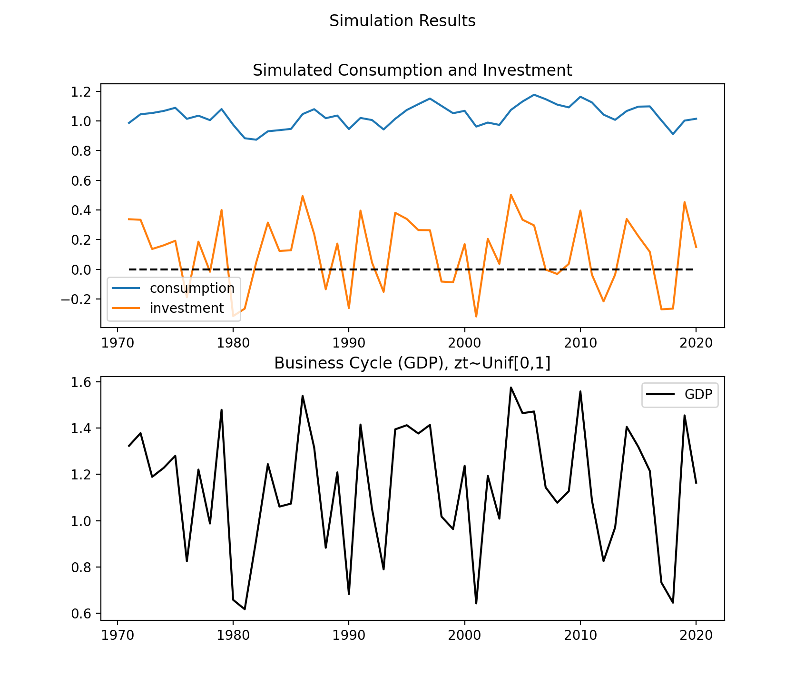
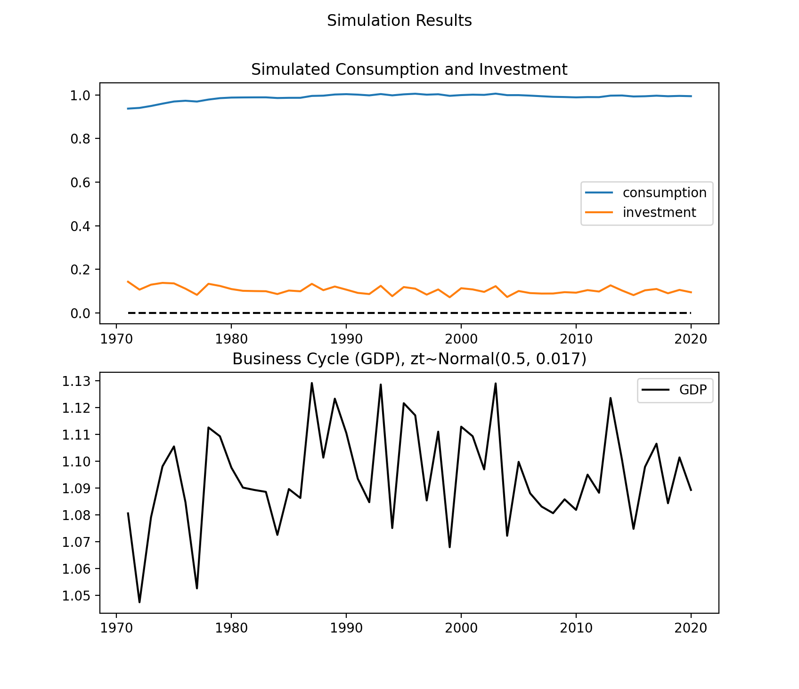

```{r setup, include=FALSE}
knitr::opts_chunk$set(echo = TRUE, warning=FALSE, message=FALSE)
```
```{r pacakges, include=FALSE}
library(tidyr)
library(dplyr)
library(data.table)
library(ggplot2)
library(scales)
library(mFilter)
library(quantmod)
```

\begin{abstract}
In this paper, I emulate common methods of Real Business Cycle research in a simplified and algebraically straightfoward setting. First, I take data on Japanese real GDP per capita (in local currency units) and deconstruct it to draw out its trend and cyclical component. Next, I formulate a simplistic model of the economy with random stochastic shocks to its productivity, and run a simulation of the model. Finally, I compare the results of the model with the empirical reality of business shocks in Japan. The comparison focuses on the qualitative similarities between the model and the real world data, as the purpose of this paper is not to fine-tune parameters with sophisticated calibration methods and maximize the efficiency of the model, but rather to provide a general and intuitive overview of how macroeconomic analysis is conducted. 
\end{abstract}

# Introduction  

    As stated in the abstract, the purpose of this paper is to offer a rough approximation of the steps of macroeconomic research in a simple and intuitive capacity such that even an undergraduate can readily approach. To do this, I will take the following steps:  
    First, I will compute the trend of real GDP and its cyclical component, making observations on its characteristics. Then, I will formulate a simple model for business cycles by incorporating random shocks to total factor productivity based on the neoclassical growth model. Finally, I will run simulations of the formerly derived model and compare its results to the empirical data.  

# Empirical Data  

    Business cycles, put loosely, are the deviations of real GDP from their trend. A country's GDP follows a clear trend, but are known to deviate from their projected course at regular intervals (the intervals were more consistent in the previous century). Here, we take Japanese real GDP per capita data (shown in local currency units) drawn from the World Bank and extract the trend of the data, using this to compute the cyclical component of Japanese GDP which we define to be the real business cycles. Data is taken from 1971 to 1920. The below graph shows the raw real GDP data.   

```{r data}
### Download and edit data
dfjp <- read.csv("data/gdppercapjplcu.csv")
jplong <- gather(dfjp, year, gdp_percap, X1971:X2020, factor_key=TRUE)
jplong$year <- as.numeric(substr(jplong$year, 2, 5))

### Plot
plotgdp <- ggplot(data=jplong, aes(x=year, y = gdp_percap)) + 
  geom_line() +
  scale_y_continuous(labels = unit_format(unit = "K", scale = 1e-3)) +
  labs(x = "year", y = "Real GDP Per Capita (LCU)", 
  title="Japan's Real GDP Per Capita")
plotgdp
```
  
    Next, we calculate the trend data from the above. For this, we use the Hodrick-Prescott filtering method, specifying the smoothing parameter $\lambda = 100$ since we are using annual data. Beause we are interested in the relative difference of the trend and raw data (our focus is not on accuracy), we use log GDP data for our analysis.   
```{r}
### Compute trends
jplong.hp <- hpfilter(log(jplong$gdp_percap),freq = 100, type="lambda") # hodrick-prescott filter
jplong$trend <- jplong.hp$trend # trend data 
jplong$cyclical <- jplong.hp$cycle # cyclic data 
jplong$log_gdp <- log(jplong$gdp_percap) # log GDP 

### Plot data
hpfplot <- ggplot(jplong, aes(x=year)) +
  geom_line(aes(y=log_gdp, colour = "Log(Real GDP per Capita)")) +
  geom_line(aes(y=trend, colour = "Trend")) + 
  scale_color_manual("", 
                     breaks=c("Log(Real GDP per Capita)", "Trend"), 
                     values=c("darkred", "steelblue")) + 
  labs(x = "year", y="", title="Hodrick-Prescott filter of Log(GDP per capita)") 
hpfplot
```
   
    Next, we find the cyclical component (business cycles) of the data. This is computed from the difference between the raw and trend data we have computed above. Furthermore, since we are interested in describing the characteristics of these cycles, we also separately compute and highlight the peaks of the cycles. The peaks can be defined as points of the cycle which exceed in value from their adjacent points in a neighborhood of $m$. Here we use $m=2$, so the peaks in the data shown below are points whose value exceeds 2 points immediately preceding them and 2 points immediately succeeding them.  

```{r}
### Finding Peaks 
find_peaks <- function (x, m = 2){
  # define peak as t: t >= [t-m, t+m]
    shape <- diff(sign(diff(x, na.pad = FALSE)))
    pks <- sapply(which(shape < 0), FUN = function(i){
       z <- i - m + 1
       z <- ifelse(z > 0, z, 1)
       w <- i + m + 1
       w <- ifelse(w < length(x), w, length(x))
       if(all(x[c(z : i, (i + 2) : w)] <= x[i + 1])) return(i + 1) else return(numeric(0))
    })
     pks <- unlist(pks)
     pks
}
peaks <- find_peaks(jplong$cyclical)
year_pks <- jplong$year[peaks]
cyclical_pks <- jplong$cyclical[peaks]
peaksdf <- data.frame(year_pks, cyclical_pks)

### Plotting Business Cycles
cyclicalplot <- ggplot(jplong, aes(x=year, y=cyclical)) +
  geom_line() + 
  geom_point(data=peaksdf, aes(x=year_pks, y=cyclical_pks), color="red") + 
  labs(x = "year", y="", title="Japanese Business Cycles") +
  geom_hline(aes(yintercept=0), color = "red")
cyclicalplot
```
From the above, we can count 9 peaks in our data. Sure enough, the cycles seem to be occurring at regular intervals, although the high concentration of cyclical fluctuation between 1990 and 2000 is characteristic of Japan and the Bubble inflation it experienced during this period as well as other shocks. The amplitude of the fluctuations in the cycles seems to be diminishing as the years progress, but the intervals seem pretty much consistent. Although the cycles vary quite widely, there is no noticeable pattern to them, suggesting that the mechanism behind their creation is stable. The mean number of years between peaks is about 5.4 years.
```{r}
mean(diff(peaksdf$year))
```

\newpage
# Building the Model  

    Because our purpose in this paper is to elucidate the process of macroeconomic research in as straightforward a manner as possible, the model we provide prioritizes simplicity over accuracy.  
    Instead of dealing with a model with an infinitely lived agent, where uncertainty significantly complicates the problem, we reduce our model to dealing with a representative agent who lives for one period only. The agent's primary concern is $c_t$, or their consumption in that period. However, we also assume that this person has a child who lives in the next period, and passes on capital $k_{t+1}$ to the child, determined by the standard law of motion for capital (i.e., sum of depreciated inherited capital and investment). Furthermore, every individual in our model uses their resources to determine their consumption and investment. Their resources are determined by the capital they receive from their parents preceding them, and goes through a production function which considers a stochastic shock $z_t$ to total factor productivity (for convenience, we separate the stochastic shock and the TFP $B$). Combining all of this, we have our problem: 
$$\begin{aligned}
\max \;&U(c_t, k_{t+1}) \; \;\;\; s.t. \\
&c_t + i_t = F(k_t, z_t)  \\
&k_{t+1} = (1 - \delta) k_t + i_t
\end{aligned}$$

    Let us assume the form of the functions $U()$ and $F()$, which are the utility function and production function respectively. Let $U(c_t, k_{t+1}) = \log (c_t) + A \log (k_{t+1})$ and $F(k_t, z_t) = Bk_t^{\frac{1}{2}} + z_t$. Note that the total factor productivity $B$ is constant, and we represent stochastic shocks as a separate variable $z_t$. However, this can still be interpreted as a shock to total factor productivity.  
$$\begin{aligned}
\max \;\;&\log (c_t) + A \log (k_{t+1}) \; \;\;\; s.t. \\
&c_t + i_t = Bk_t^{\frac{1}{2}} + z_t  \\
&k_{t+1} = (1 - \delta) k_t + i_t
\end{aligned}$$
    Now, we can derive the solution to our model:
$$\begin{aligned}
\max \;\;\log \left(Bk^\frac{1}{2} + z_t - i_t\right) + A\log\left((1 - \delta) k_t + i_t\right)
\end{aligned}$$
Taking the first order condition with respect to $i_t$, we have 
$$-\frac{1}{B\sqrt{k_t} + z_t - i_t} + \frac{A}{(1 - \delta) k_t + i_t} = 0$$
Solving this, we get 
$$\begin{aligned}
i_t^* &= \frac{A[B\sqrt{k_t} + z_t] - (1-\delta)k_t}{1 + A} \\
\implies c_t^* &= \frac{B\sqrt{k_t} + z_t + (1- \delta)k_t}{1 + A}
\end{aligned}$$

    Notice  the following: 
$$\begin{aligned}
\frac{\partial}{\partial z_t}i_t^* &= \frac{A}{1 + A} \\
\implies \frac{\partial}{\partial z_t}c_t^* &= \frac{1}{1 + A}
\end{aligned}$$
Assuming $A>1$, which is reasonable, the above is in congruence with the well known fact that investment responds more sharply to business cycle fluctuations than does consumption.  

# Simulation  

    In this section, we simulate our model to observe how well it approximates the process of real business cycle shocks. In our model, $A$ is roughly the ratio of consumption and capital in the steady state. We could in theory calibrate $A$ to fit the empirical reality and improve upon our model, but for now we let $A=4$. $B$ is the constant element of total factor productivity, and only affects the scale of the graph for our simulation, not the shape, and thus is of secondary importance. We let $B = 0.3$. The depreciation rate $\delta = 0.025$. Now, we simulate $c$ and $i$ and $gdp = c + i$ in our economy by specifying the initial level of capital $k_0 = 3.7$. Furthermore, we examine the case for two distributions of the random shock $z$, $z\sim Unif[0,1]$ and $z \sim N(0, 0.17)$. The results are as follows: 
  


    The simulation results show us that our model indeed produces cyclical fluctuations in GDP data, and hints towards the workings of real business cycles in real life. While consumption in both cases is relatively constant across time, investment is heavily influenced by the stochastic shocks of each period, creating the source for the business cycle fluctuations. We can observe that with the normal distribution, the amplitude of the cycles are much smaller than those of the uniform distribution. The normal distribution does a better job of capturing the nature of actual stochastic shocks to productivity in the sense that high magnitude shocks do not occur so frequently. Both graphs, when compared to the original graph charting Japanese real business cycles, do differ quite heavily in characteristics. Perhaps greater care in selecting parameters to the model, which is known as "model calibration", could somewhat improve its accuracy. Indeed, many macroeconomic studies rely on calibration to assess the accuracy of and develop on models. 

```{r echo = FALSE}
simdf <- read.csv("data/sim_unif_shock.csv")
simpeaks <- find_peaks(simdf$gdp)
year <- simdf$year[simpeaks]
gdp <- simdf$gdp[simpeaks]
simpeaksdf <- data.frame(year, gdp)

### Plotting Business Cycles
simgdpplot <- ggplot(simdf, aes(x=year, y=gdp)) +
  geom_line() + 
  geom_point(data=simpeaksdf, aes(x=year, y=gdp), color="red") + 
  labs(x = "year", y="", title="Simulated Business Cycles under Uniform Shocks")
```

```{r, echo = FALSE, fig.show="hold", out.width="50%"}
cyclicalplot
simgdpplot
```

    When comparing the simulation results for uniform shocks with Japanese business cycles, we immediately notice that there are far more cycles in the simulation than there are in the empirical data. This suggests that are model is overestimating the variance of the random shocks to productivity. The variation in amplitude of cycles, however, is similar, although there is no sign of the amplitude decreasing over time in our model. Both graphs have high variation in amplitude. However, there is no observable trend to the position of the peaks of the simulated business cycles as there seems to be in the Japanese business cycles. I assume this is due to real life stochastic shocks being dependent on preceding shocks, and not independent of them. In our simulation, all shocks were modeled as independent, making it difficult for such a pattern to emerge. Finally, the mean distance between peaks for our simulated model is significantly less than the mean distance between peaks for the empirical data. 

```{r}
mean(diff(simpeaksdf$year))
```

```{r, echo = FALSE}
simdf <- read.csv("data/sim_normal_shock.csv")
simpeaks <- find_peaks(simdf$gdp)
year <- simdf$year[simpeaks]
gdp <- simdf$gdp[simpeaks]
simpeaksdf <- data.frame(year, gdp)

### Plotting Business Cycles
simgdpplot <- ggplot(simdf, aes(x=year, y=gdp)) +
  geom_line() + 
  geom_point(data=simpeaksdf, aes(x=year, y=gdp), color="red") + 
  labs(x = "year", y="", title="Simulated Business Cycles under Normal Shocks")
```

```{r, echo = FALSE, fig.show="hold", out.width="50%"}
cyclicalplot
simgdpplot
```

    The simulation under normal shocks is somewhat better at approximating real life business cycles than the simulation under uniform shocks, although it is still not much of an improvement. In the model under normal shocks, we have 8 peaks, just two more than the empirical data. Furthermore, the position of the peaks seems to be closer together than the uniform data, making it more similar to the real Japanese business cycles. However, the limitations we discussed earlier are also applicable here. The shape of the cycles do not seem to be strongly related to each other, and thus is a poor reflection of the shape of the Japanese business cycles. The amplitude of the cycles does not have any clear pattern either. The mean between the peaks is 6 years, while the Japanese business cycles generally had intervals of around 8 years.   
```{r}
mean(diff(simpeaksdf$year))
```  
    Our model did not have a government nor did it have a central bank, and the lack of such a stabilizing entity may also be one of the sources of discrepancies between it and the real world.  

# Conclusion  

    All in all, our model showed us that it is possible to model cyclical fluctuations in output with the neoclassical growth model by introducing stochastic shocks. In real business cycle analysis, researchers aim to further the understanding of business cycles by formulating such fully specified stochastic models and testing them via "calibration". Although the accuracy of our model could be heavily improved upon, at the very least it shows the creativity and appropriateness of this approach to studying business cycles.  

# References  

\setlength{\parindent}{-0.2in}
\setlength{\leftskip}{0.2in}
\setlength{\parskip}{8pt}
\noindent

Plosser, Charles. 1989. “Understanding Real Business Cycles”. Journal of Economic Perspectives 3(3): 51-78. 

The World Bank, World Development Indicators (2012). Real GDP per capita (LCU). Retrieved from https://data.worldbank.org/indicator/NY.GDP.PCAP.CN?locations=JP  
  