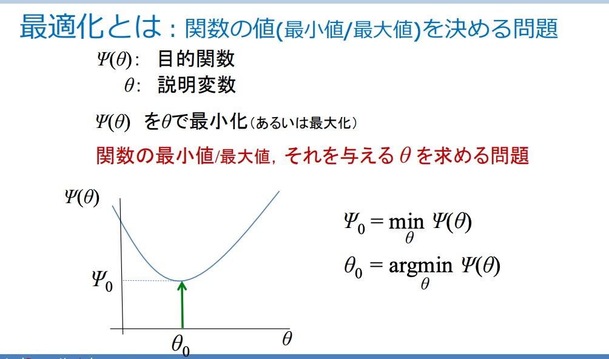
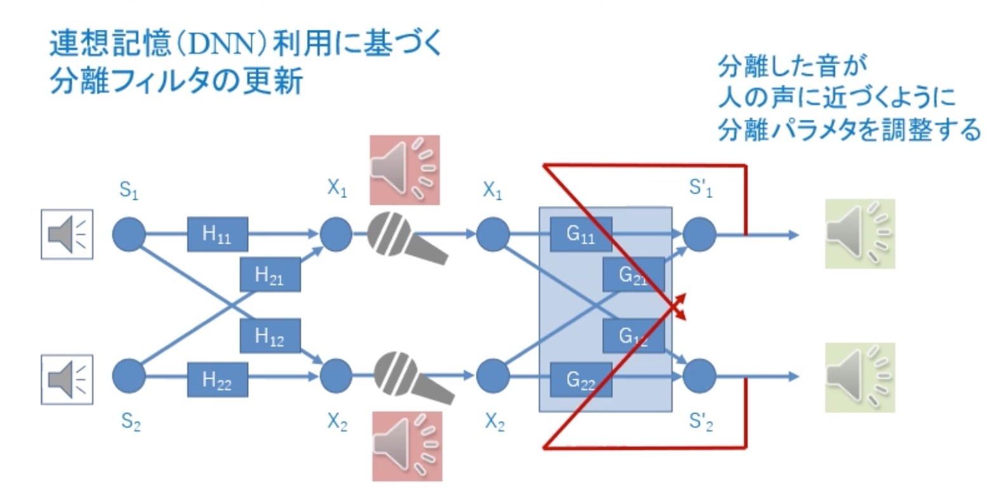

```{r setup, include=FALSE}
knitr::opts_chunk$set(echo = TRUE)
```

# Types of Optimization  

## Finding Extremums  

{height=40%}

## Determining Shape of Function  

{height=40%}
Find the value of variable $\theta_0$ such that the error function $\Psi(\theta)$ is minimized. Note that this optimization problem can be translated into the first type (optimizing by finding extremums) through the use of an error function. Many approximation problems make use of this method.  

## Determining Optimal Sequence in Sequential Decision Process  


$\theta$ represents a sequence of actions, $A$ represents the sequence of states determined by $\theta$, and $\Psi(\theta)$ is the cost of taking a certain $\theta$, computed as $\sum_{ij\in A} C_{ij}$.  

# Formal Definition

\[\begin{aligned}
\Psi(\theta):& \text{ Objective (Target) Function} \\
\theta:& \text{ Explanatory Variable determining } \Psi
\end{aligned}\]

Optimization means to minimize (maximize) $\Psi$ using $\theta$.  
  
# Formal Characterization  

## Continuous Optimization  
\begin{itemize}
\item \textbf{Nonlinear Programming Problem}: \newline
Includes nonlinearity in objective function or constraints. 
\begin{itemize}
\item \textit{Quadratic Programming Problem}: \newline
Objective function is a quadratic function, constraints are linear  
\item \textit{Convex Programming Problem}: \newline
Objective function is a convex function, area of constraint is convex
\end{itemize}
\item \textbf{Linear Programming Problem}: \newline
Objective function is linear, constraints are linear  
\end{itemize}

## Discrete Optimization  
\begin{itemize}
\item \textbf{Combinatorial Optimization Problem}  
\item \textbf{Integer Programming Problem}
\begin{itemize}
\item \textit{0-1 Integer Programming Problem:} \newline
Variables are either 0 or 1  
\end{itemize}
\end{itemize}

# Application Example: Facial Recognition  

\[\begin{aligned}
\theta:& \text{ Model for Facial Features} \\
\Psi(\theta):& \text{ Pixel Error}
\end{aligned}\]

Begin by defining a model $\theta$ for facial features. The one below takes several prominent points of the face and connects them to form triangles. Then, we can define the error function $\Psi(\theta)$ to be the squared sum of pixel differences; that is, if a triangle on the training set captures black pixels but when applied to the testing set captures beige pixels, that is computed as an error. Then, the $\theta$ that minimizes $\Psi(\theta)$ provides us with a model for the test data.  
{width=50%}

# Application Example: Audio Source Separation  

Two audio sources, two microphones, 4 paths (transformation functions) for the audio to travel. We can reverse this filter by feeding it back into the loop until each output audio sounds closer and closer to a normal human being.  
{width=70%}

# Solving Continous Optimization: Gradient Method  

There is no analytic solution to continuous optimization, but one method is to approximate an initial value and study the gradient in the neighborhood of this value to arrive at the optimum.  
{width=70%}

We can add equality and inequality constraints of the parameters $\theta_1, \theta_2$ to the above:  

{width=50%}{width=50%}

# Discrete Optimization Problems:  

{width=50%}{width=50%}


