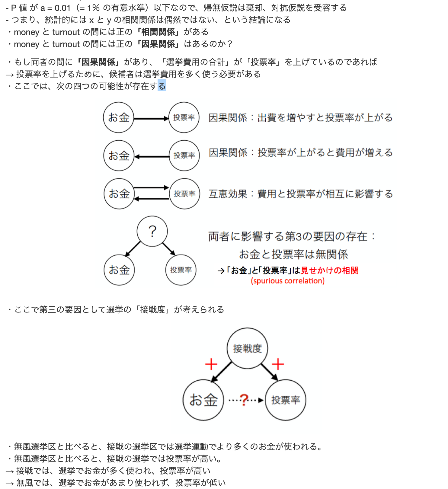

library(readr)
library(dplyr)
cabinet1 <- read_csv("data/chi2_data1.csv", na = ".") 

head(cabinet1)
table_cabinet1 <- with(cabinet1, table(male, support))  
table_cabinet1
```{r}
table_cabinet1
```

## まず列周辺度数を加える; margin=1 で列周辺度数のみ加える
row_cabinet1 <- addmargins(table_cabinet1, margin = 1) 

## 度数を比率に変換する; margin=1 で行パーセント
row_cabinet1 <- prop.table(row_cabinet1, margin = 1)

## パーセント表示に変換する; 小数第2位までの表示にする
row_cabinet1<- round(100 * row_cabinet1, 2)

## 行周辺度数を加えて表示する; margin=2 で行周辺度数のみ加える
addmargins(row_cabinet1, margin = 2)

```{r}
row_cabinet1
```

```{r}
addmargins(row_cabinet1, margin = 2)
```
```{r}
row_cabinet1 <- addmargins(table_cabinet1, margin = 1) %>%
prop.table(margin = 1) %>%
round( 2) %>%
addmargins(margin = 2)*100
```
```{r}
row_cabinet1
```
```{r}
col_cabinet1 <- addmargins(table_cabinet1, margin = 2) %>%
  prop.table(margin = 2) %>%
  round(digits = 4) %>%
  addmargins(margin = 1)*100
col_cabinet1
```


```{r}
total_cabinet1 <- prop.table(table_cabinet1) %>%
  round(2) %>%
  addmargins()*100
total_cabinet1
```


```{r}
cabinet2 <- read_csv("data/chi2_data2.csv", na = ".")
```
```{r}
names(cabinet2)
```

```{r}
head(cabinet2)
```

```{r}
table_cabinet2 <- with(cabinet2, table(male,support))
addmargins(table_cabinet2)
```

```{r}
chisq.test(cabinet2$male, cabinet2$support, correct = FALSE)
```
#since p-value takes a value below 0.5, null hypothesis is discarded. 

```{r}
cabinet4 <- read_csv("data/chi2_data4.csv", na = ".") 
```
```{r}
table_cabinet4 <- with(cabinet4, table(male, support))  
addmargins(table_cabinet4)
```
```{r}
fisher.test(table_cabinet4, alternative = "less")
```
#since p-value > 0.05, null hypothesis is not discarded


# Correlation Coefficient 

```{r}
x <- c(1, 5, 10)
y <- c(1, 2, 10)
```

```{r}
xy <-data.frame(x, y)
```
#combine matrices x, y and create dataframe

```{r}
plot(x ~ y)
```

If we want to make a cleaner graph 

library("ggplot2")
```{r}
ggplot(xy, aes(x, y)) + 
  geom_point() +
  stat_smooth(method = lm, se = FALSE)
```

#find correlation coefficient
```{r}
cor(x, y)
```
#find correlation coefficient and p value 

```{r}
cor.test(x, y)
```
x と y の相関係数（= 0.936599)
p 値（= 0.2279）
p 値（= 0.2279）（つまり 22.79％）が意味していること
帰無仮説：「x と y の相関係数は 0」が正しいとすれば、このようなデータが出現する確率は 22.79％という意味
P 値 が a = 0.05（= 5％ の有意水準）を超えているため、帰無仮説は棄却できない
つまり、統計的には x と y の相関関係は認められない、という結論になる


# 相関関係と因果関係
相関関係があるからといって、必ずしも因果関係があるとは限らない。
次の二つの変数の相関を調べてみる

x 軸・・・選挙区ごとに候補者が費やした選挙費用合計：千万円
y 軸・・・選挙区ごとの投票率：%

人工的に架空のデータを作ってみる
```{r}
set.seed(12345)
#乱数の種を設定

# 50%の確率 (.5) で 0 か 1 の値を 100 個、無作為に抽出し comp と名前を付ける
comp <- rbinom(100, 1, .5)

# 選挙費用合計を 100 個、無作為に抽出し money と名前を付ける  
# サンプルを取り出す元になる母平均と母標準偏差を任意に指定する
money <- rnorm(100, mean = 0.4 + 0.5*comp, sd = 0.2) 

# 投票率を 100 個、無作為に抽出し turnout と名前を付ける  
# サンプルを取り出す元になる母平均と母標準偏差を任意に指定する
turnout <- rnorm(100, mean = 0.4 + 0.3*comp, sd = 0.1)
```

人工的に作り出した三つの変数をデータフレームに入れ df と名前を付け、データを表示する
```{r}
df <- data.frame(money = money,
                 turnout = turnout,
                 comp = as.factor(comp))
head(df)
```
```{r}
plt <- ggplot(df, aes(x = money, y = turnout)) +
  geom_point() +
  geom_smooth(se = FALSE, method = 'lm') +
  labs(x = "選挙費用の合計（千万円）", y = "投票率")
plt
```

(dont forget:
theme_set(theme_classic(base_size = 10,
                        base_family = "HiraginoSans-W3")))
                        
```{r}
cor.test(money, turnout)
```
```{r}

```

```{r}
hr <- read.csv("data/hr96_14.csv", na = ".")
```

```{r}
hr2009 <- hr %>%
  filter(year == 2009) %>% 
  select(age, nocand, rank, wl, previous, vote, voteshare, eligible, exp, exppv)
names(hr2009)
```

```{r}
corHR <- cor(hr2009, use = "complete.obs") 
corHR
```

```{r}
cor1 <- qgraph(
  corHR,
  graph = "glasso",
  sampleSize = nrow(hr2009),
  tuning = 0,
  layout = "spring",
  title = "Correlations among variables of HR elections",
  details = TRUE
)
```

```{r}
qgraph(cor1,
       filetype = 'pdf',
       filename = "cor_hr2009",
       height = 5,
       width = 10)
```

# Assignments

LDP1 <- read_csv("data/chi2_ass_data.csv", na = ".")

```{r}
names(LDP1)
```

```{r}
table_LDP1 <- with(LDP1, table(male, evaluation))  
table_LDP1
```
```{r}
addmargins(table_LDP1)
```

```{r}
total_LDP1 <- prop.table(table_LDP1) %>%
  round(2) %>%
  addmargins()*100
total_LDP1
```
帰無仮説：評価の割合には男女差はない
対立仮説：評価の割合には男女差がある（男性の方がLDPを評価する）

```{r}
chisq.test(LDP1$male, LDP1$evaluation, correct = FALSE)
```
帰無仮説は棄却，差はあると言える．

Assignment 2 

data(women)

women <- data.frame(women)
```{r}
women
```

```{r}
women <- mutate(women, height = height*2.54, weight = weight * 0.4536)
women
```

```{r}
plt <- ggplot(women, aes(x = height, y = weight)) +
  geom_point() +
  geom_smooth(se = FALSE, method = 'lm') +
  labs(x = "Height", y = "Weight")
plt
```


```{r}
with(women, cor(height, weight))
with(women, cor.test(height, weight))
```


```{r}
HR <- read_csv("data/hr96_14.csv", na = ".")
```

```{r}
HR12 <- HR %>% 
  filter(year == 2012) %>%
  select(age, nocand, rank, wl, previous, vote, voteshare, eligible, exp, exppv)
glimpse(HR12)
```

```{r}
with(HR12, cor(age, nocand))
with(HR12, cor(age, rank))
with(HR12, cor(age, exp))
with(HR12, cor(age, vote))
```

```{r}
corHR12 <- cor(HR12, use = "complete.obs")
corHR12
```

```{r}
qgraphHR12 <- qgraph(
  corHR12,
  graph = "glasso",
  sampleSize = nrow(HR12),
  tuning = 0,
  layout = "spring",
  title = "Correlations among variables of HR 2012 elections",
  details = TRUE
)
```


